# IMDb Top 250 Stats

This is a repo to look at statistics on the top 250 movies on imdb.com. (Data pulled 11/9/19)

## Results

### Interesting Finds

A good chunk of the top 250 are movies from the last 40 years. 

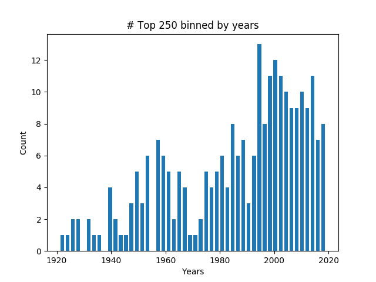

Witness the birth of animation, the acceleration of action movies, and the heydays of film-noir (40s) and westerns (60s) 

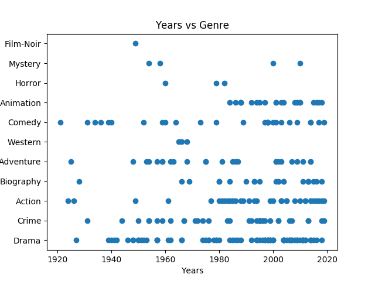
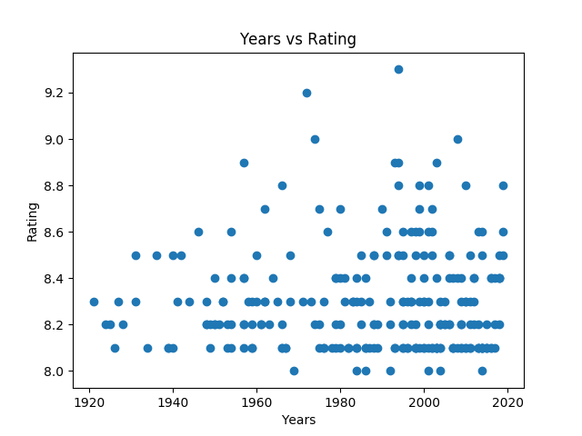
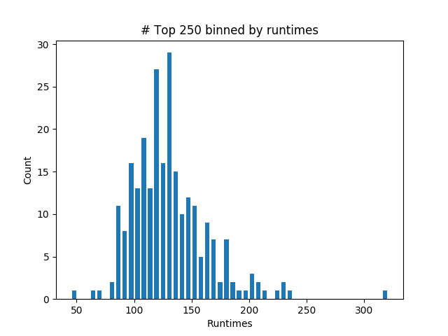
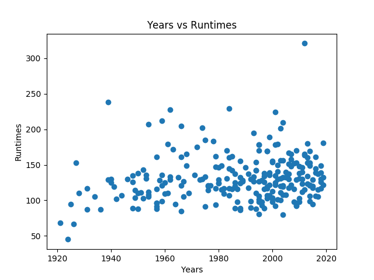
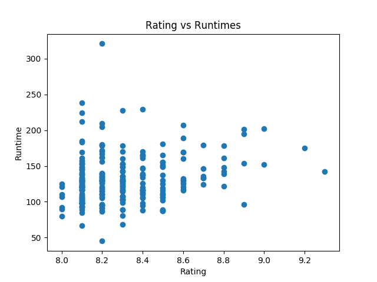

### Possibly Interesting Finds

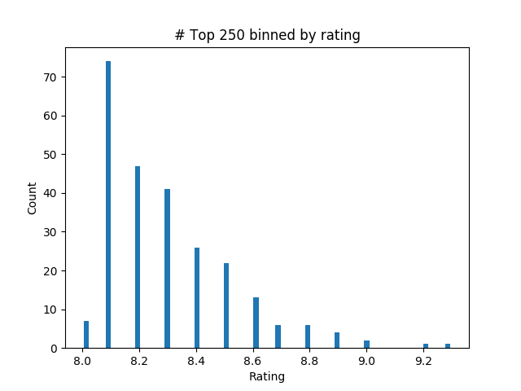
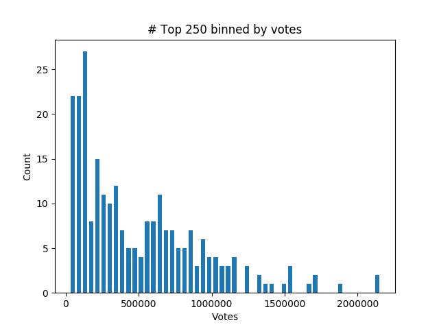
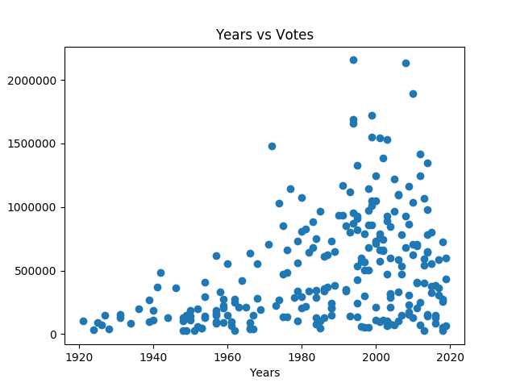
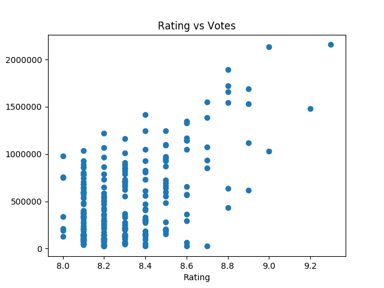
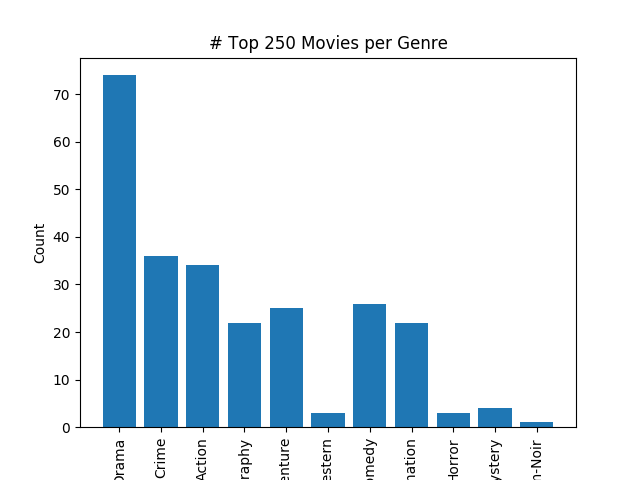
